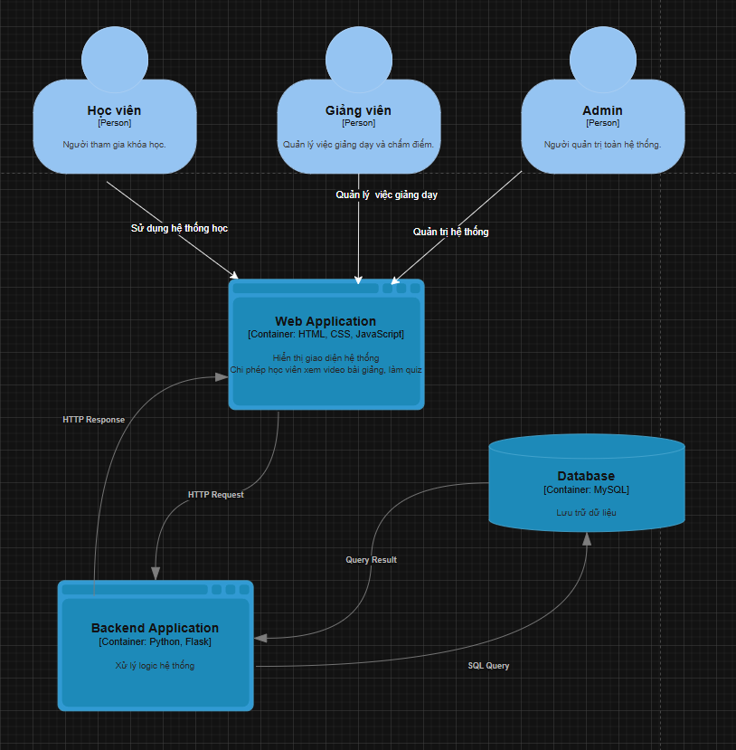

# E-Learning

## Mô tả
Xây dựng một nền tảng học tập trực tuyến cho phép người dùng đăng ký, tham gia các khóa học và quản lý tiến độ học tập cá nhân.
## Thành viên nhóm
| MSSV | Họ tên | Vai trò |
| :--- | :--- | :--- |
| 2351010235 | Nguyễn Minh Tú | Nhóm trưởng |
| 2351010141 | Giang Nhật Nguyên | Thành viên |
## Công nghệ sử dụng
- Backend: Python
- Frontend: HTML, CSS
- Database: MySQL
- Message Queue: 
- Container: Docker + Docker Compose
## Kiến trúc
[Mô tả kiến trúc đã chọn]

## Cài đặt và chạy
### Yêu cầu
- Docker Desktop
- Git
### Chạy với Docker Compose
git clone https://github.com/username/project-name
cd project-name
docker-compose up -d
### Truy cập
- Frontend: http://localhost:3000
- Backend API: http://localhost:8000
- RabbitMQ Management: http://localhost:15672
## Demo
[Link video demo hoặc screenshots]
## Tài liệu
- [ADRs](docs/adrs/)
- [API Documentation](docs/api/)