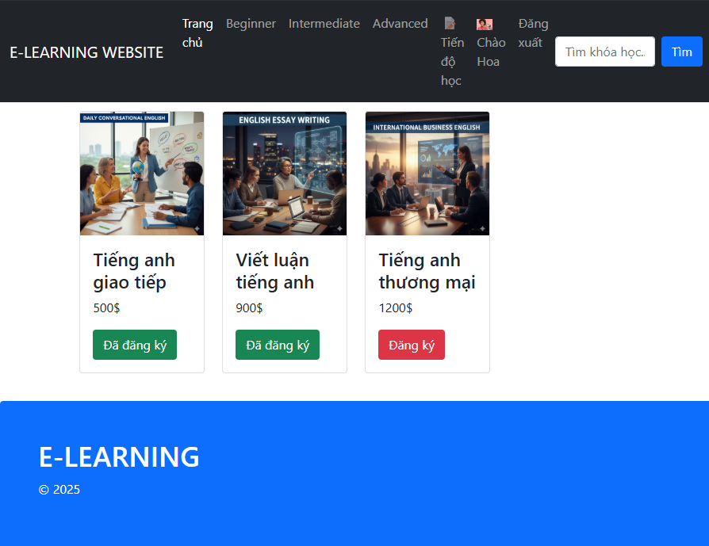
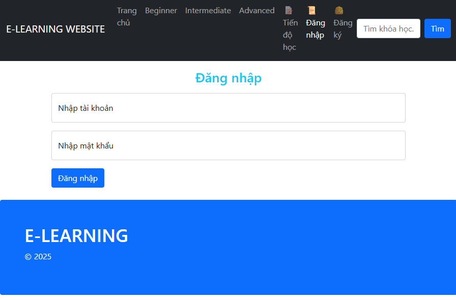
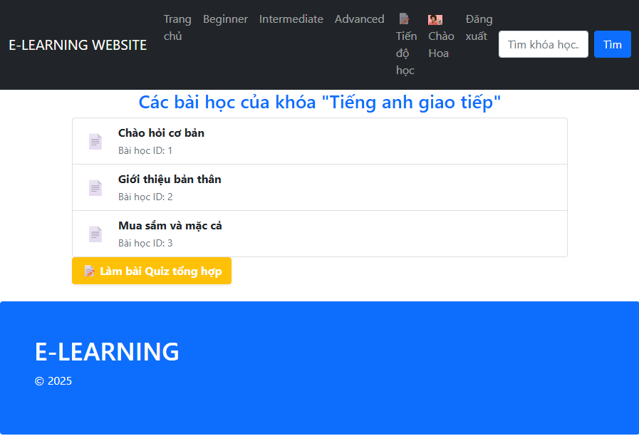
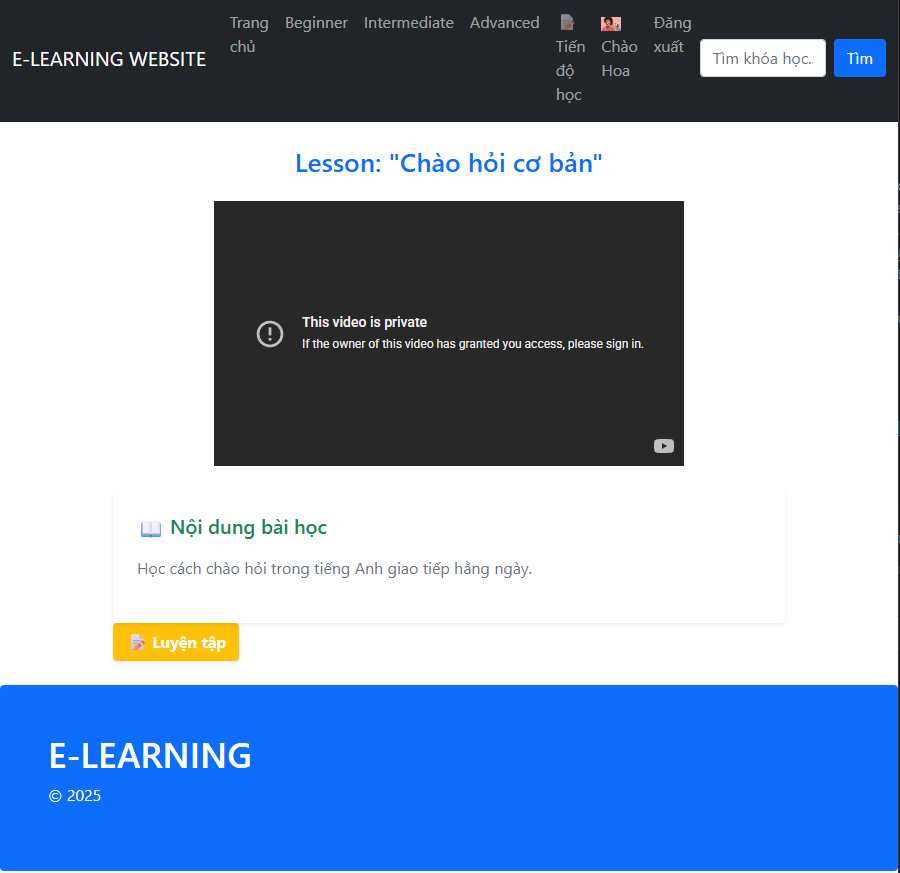
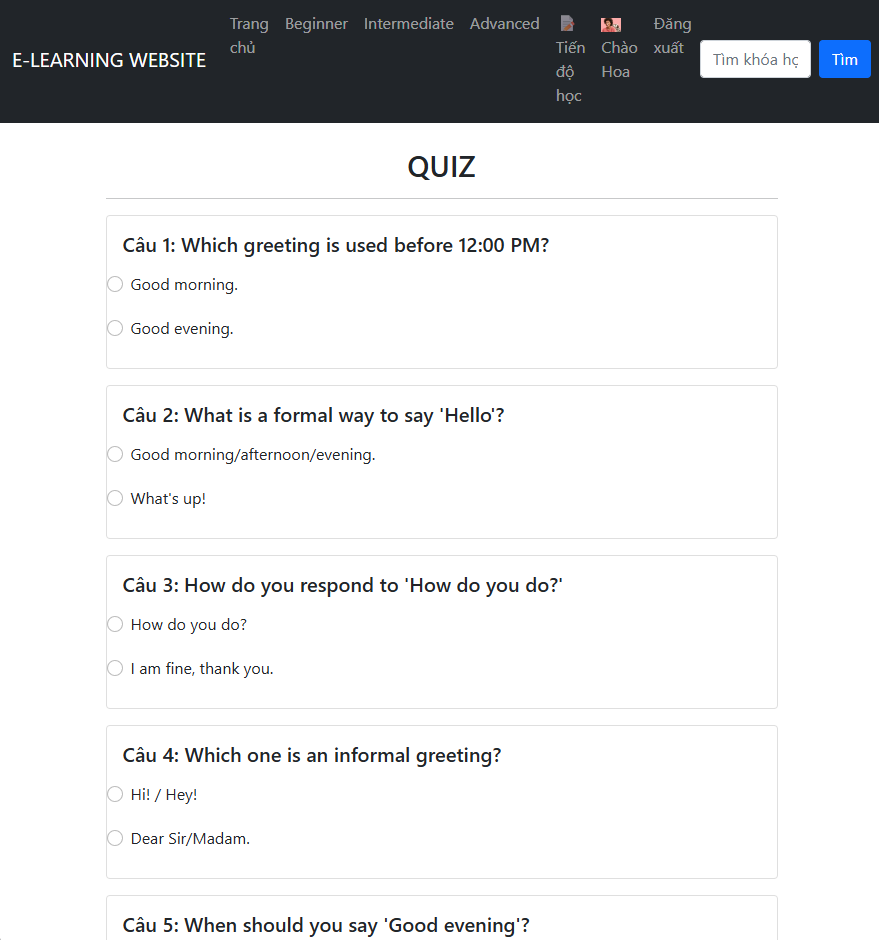
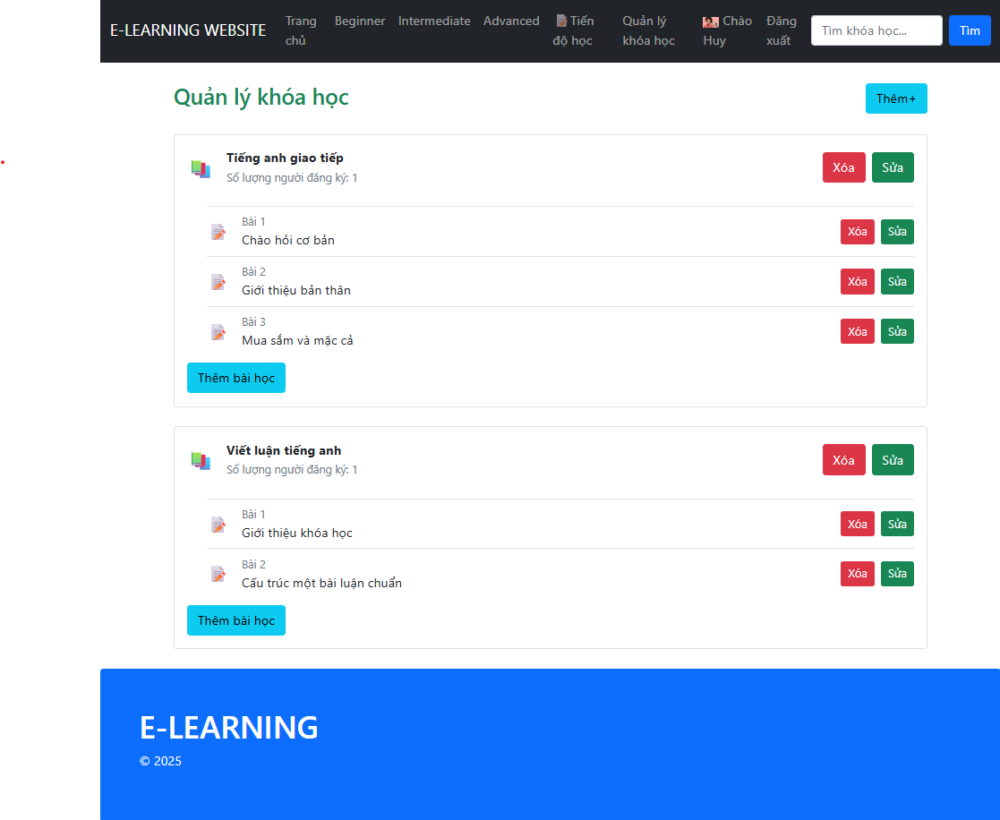
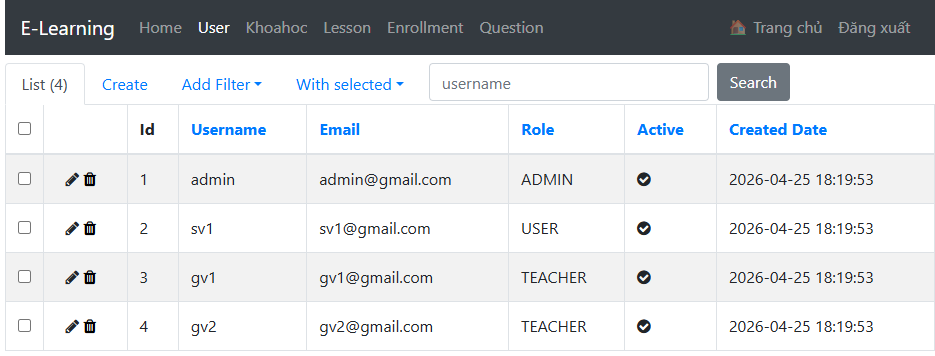

# E-Learning

## Mô tả
Xây dựng một nền tảng học tập trực tuyến cho phép người dùng đăng ký, tham gia các khóa học và quản lý tiến độ học tập cá nhân.
## Thành viên nhóm
| MSSV | Họ tên | Vai trò |
| :--- | :--- | :--- |
| 2351010235 | Nguyễn Minh Tú | Nhóm trưởng |
| 2351010141 | Giang Nhật Nguyên | Thành viên |
## Công nghệ sử dụng
- Backend: Python
- Frontend: HTML
- Database: MySQL
- Message Queue: Rabbit MQ
- Container: Docker + Docker Compose
## Kiến trúc
**Kiến trúc phân tầng (Layered Architecture)** + **Message Broker**
* **Tầng Giao diện (Presentation Layer):** Sử dụng các templates HTML/Jinja2 được render trực tiếp từ Flask.
* **Tầng Điều khiển (Controller Layer):** Flask Routes (`index.py`, `admin.py`) xử lý các request từ người dùng.
* **Tầng Dữ liệu (Data Access Layer):** Tách biệt logic truy xuất cơ sở dữ liệu thông qua `dao.py` và SQLAlchemy ORM (`models.py`).
* **Xử lý bất đồng bộ:** Tích hợp **RabbitMQ** để hỗ trợ hàng đợi tin nhắn (Message Queue).
## Cài đặt và chạy
Dự án đã được đóng gói hoàn toàn bằng Docker, giúp việc triển khai trở nên đồng nhất và nhanh chóng.
### Yêu cầu
- Docker Desktop
- Git
### Chạy với Docker Compose
- git clone [https://github.com/nguyenminhtuuuu/E-Learning.git](https://github.com/nguyenminhtuuuu/E-Learning.git)
- cd project-name
- docker-compose up -d

**Tạo database (lần đầu chạy)**
- docker exec -it elearning_backend python backend/src/models.py
### Truy cập
- E-Learning Web App: http://localhost:5000
- RabbitMQ Management: http://localhost:15672

### Xác minh RabbitMQ hoạt động
- Theo dõi worker: docker compose logs -f worker

**Khi có sự kiện, sẽ xuất hiện log:**
  - Event received từ RabbitMQ
  - Worker xử lý message
- Ngoài ra có thể kiểm tra trực tiếp tại:
  http://localhost:15672 (RabbitMQ UI)

### Chạy UnitTest
- docker exec -it elearning_backend pytest backend/tests/
## Demo
**1. Trang chủ**

**2. Màn hình Đăng nhập**

**3. Danh sách Khóa học**

**4. Chi tiết Bài học**

**5. Làm Quiz / Bài tập**

**6. Giao diện Giảng viên**

**7. Quản trị viên (Admin)**

## Tài liệu
- [ADRs](docs/adrs/)
- [API Documentation](docs/api/)